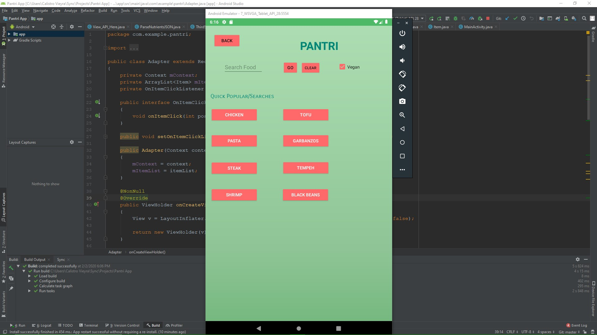

# Pantri_android_app

Pantri is a mobile app Caleb and I built. The mobile application was built using Android Studio. My buddy Caleb worked on the database, I worked on parsing and displaying the recipe API, and we both worked on the UI. We integrated a health calculator that suggests a range of daily macronutrients based on the user’s gender and body mass index. As for the recipe API, you can search any type of recipe you like based on the main dish, or you can select one of the quick links I integrated for convenience. I also provided the nutrients for any recipe searched along with the calorie information. This Pantri app is geared towards helping people learn new healthy recipes while providing a daily intake calculator to help guide the user’s when prepping meals.

